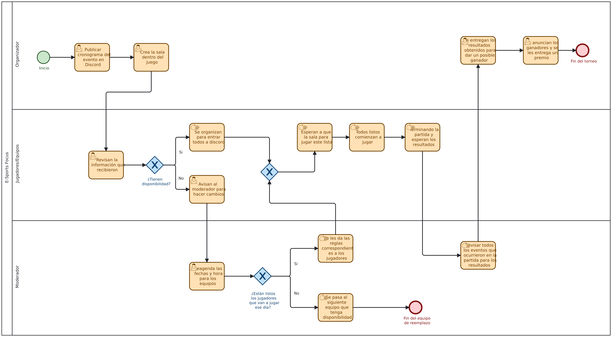

# Proceso de negocio — AS-IS
 
## Macro-proceso y proceso específico
Organización de torneos competitivos (E-Sports Focus) → Organización y desarrollo de una partida del torneo
 
## Objetivo de negocio del proceso
[Descripción]
 
## Participantes y sus objetivos
| Participante | Objetivo en el proceso |
|---------------|------------------------|
| [Rol 1] | [Objetivo] |
| [Rol 2] | [Objetivo] |
 
## Diagrama AS-IS

 
Archivo fuente: [`./diagramas/as-is.bpmn`](diagram.bpmn)
 
Nota: distingan tareas de usuario, de servicio y manuales con el marcador correspondiente.
 
## Problemas identificados
- [Problema 1, asociado al objetivo de un participante]
- [Problema 2]

## Regresar 
[Ingeniería en Requisitos - Entrega 1](IngReq-Entrega1.md)
