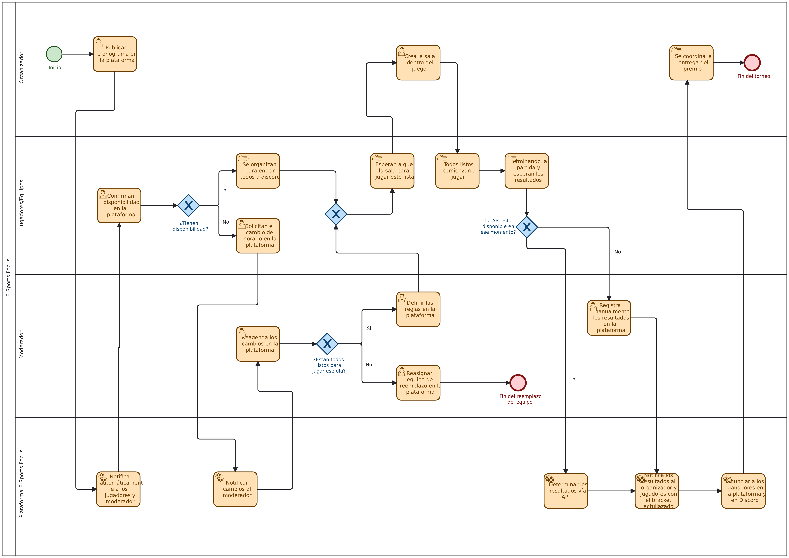

# Análisis de rediseño y propuesta TO-BE
 
## Mejoras identificadas por participante
| Participante | Objetivo | Problema | Mejora deseada |
|----------------|----------|----------|-----------------|
| Organizador | Mantener el torneo funcionando de principio a fin: publicar el cronograma, habilitar las salas del juego, anunciar resultados y premios a tiempo. | Depende de que el Moderador le informe manualmente el resultado por Discord; si se demora, no puede anunciar ganadores ni entregar premios a tiempo. | Recibir el resultado de forma automática e inmediata apenas termina la partida, sin depender de un aviso manual. |
| Jugadores/Equipos | Jugar su partida en el horario acordado y que el resultado obtenido quede correctamente reflejado en el torneo. | No recibe ninguna confirmación de que su resultado quedo bien registrada, lo que puede generar reclamos si el bracket no coincide con lo ocurrido en la partida. | Recibir confirmación automática e inmediata de que su resultado quedo registrado correctamente. |
| Moderador | Garantizar que las partidas se disputen según lo planificado y que el resultado registrado sea el real, verificándolo en vivo. | Debe verificar en vivo cada partida y reportar manualmente por Discord, incluso cuando la API del juego podría hacerlo. | Que el sistema registre el resultado automáticamente cuando sea posible, e intervenir solo cuando la API no este disponible. |
 
## Iniciativas de rediseño
### Iniciativa 1
- Actividad(es) del AS-IS que afecta: Revisar todos los eventos que ocurrieron en la partida para los resultados (Moderador) / Entregan los resultados obtenidos para dar un posible ganador (Organizador).
- Heurística aplicada: Automatización de tareas e integración con sistemas externos (via API del juego).
- Objetivo o mejora que resuelve: El organizador anuncia a tiempo los resultados y el moderador da los resultados reales.
- Efecto esperado (tiempo/costo/calidad/flexibilidad): El tiempo entre el fin de la partida y el registro del resultado baja de hora (según disponibilidad del Moderador) a segundos; mejora la confiabilidad del dato al no depender de un reporte manual como paso por defecto.

### Iniciativa 2
- Actividad(es) del AS-IS que afecta: La cadena secuencial Moderador informa -> Organizador entrega resultados -> Organizador anuncia
- Heurística aplicada: Reducción de contacto y paralelismo.
- Objetivo o mejora que resuelve: Jugadores/Equipos reciben confirmación automática e inmediata de que su resultado quedo registrado. 
- Efecto esperado (tiempo/costo/calidad/flexibilidad): El organizador y los jugadores reciben la notificación al mismo tiempo, reduciendo reclamos por discrepancia en el bracket.

### Iniciativa 3
- Actividad(es) del AS-IS que afecta: La misma que la iniciativa 1, cubriendo el caso "API no disponible".
- Heurística aplicada: Manejo de excepciones / trabajo basado en casos.
- Objetivo o mejora que resuelve: El moderador tiene una continuidad operativa cuando falta la autorización, sin volver al proceso 100% manual.
- Efecto esperado (tiempo/costo/calidad/flexibilidad): El proceso sigue funcionando aunque el juego no tenga API publica, el registro queda igual de trazable en la plataforma.

## Diagrama TO-BE

 
Archivo fuente: [`./diagramas/to-be.bpmn`](Images/diagram.bpmn)
 
## Actividades que cambian del AS-IS al TO-BE
| Actividad en el AS-IS | Actividad en el TO-BE | Qué cambia |
|-------------------------|--------------------------|------------|
| Revisan la información que recibieron (Jugadores). | Confirman disponibilidad en la plataforma (Jugadores). | Pasa de leer un mensaje de Discord a confirmar formalmente en el sistema, quedando registrado.|
| Avisan al moderador para hacer cambios (Jugadores). | Solicitan cambio de horario en la plataforma (Jugadores). | El Moderador es notificado automáticamente, en vez de recibir un mensaje suelto de Discord.|
| Revisar todos los eventos de la partida para los resultados (Moderador). | Sistema detecta el resultado automáticamente vía API del juego / Árbitro registra el resultado manualmente en la plataforma si la API no esta disponible. | Se automatiza el caso general; el Moderador solo interviene como excepcion y registra en el sistema, no reporta por Discord.|
| Entregan los resultados obtenidos para dar un posible ganador (Organizador). | Sistema notifica automáticamente el resultado el organizador. | Deja de depender de que el Moderador avise; ocurre solo.|
| Anuncian los ganadores y se les entrega un premio (Organizador). | Sistema anuncia automáticamente a los ganadores (plataforma + Discord) / Organizador coordina la entrega del premio. | Se separa el anuncio (automatico) de la entrega fisica del premio (manual).|

## Regresar 
[Ingeniería en Requisitos - Entrega 1](IngReq-Entrega1.md)
